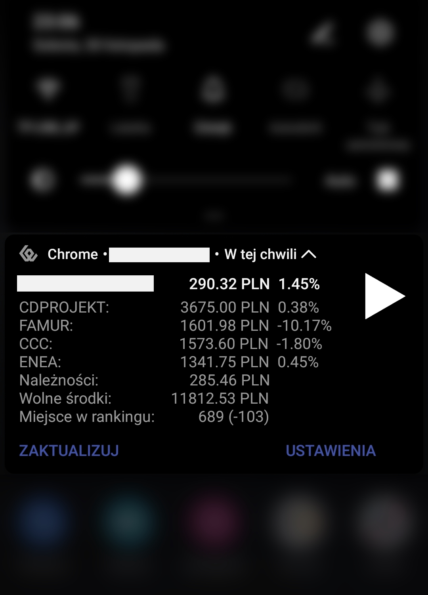
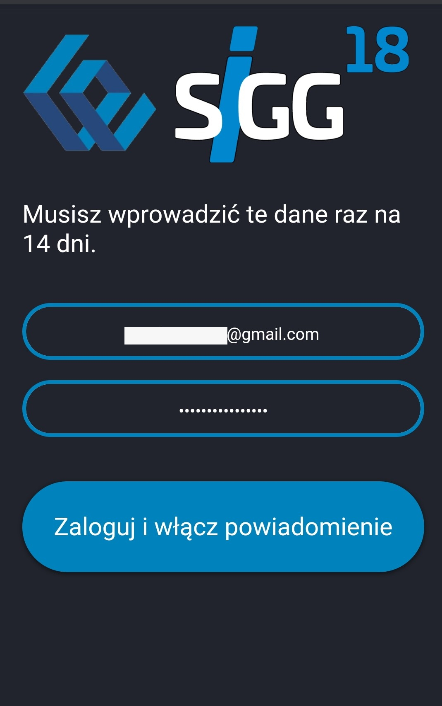

# SIGG Scraper
## PHP web scraper with frontend and PWA notifications for SIGG (sigg.gpw.pl, virtual stock market competition)
SIGG web platform was unfamous for slow load times (10s on 3G), lack of live updates and disabled caching.

This tool scrapes your SIGG wallet on the server-side and sends back only the important information (<1KB).
/live page displays wallet state and contents in a clean form and fetches new data asynchronously each second.
SIGG scraper is optimized for mobile devices and offers most of its functionality in the form of always-on notification using a service worker.

It also implements custom login solution, but stores all sensitive information and passwords only in client's local storage and cookies. This is because sigg.gpw.pl requires new session token each 6h. This tool handles it for you.

### Made With
PHP (with curl and xml parser libraries), JavaScript, HTML, CSS

## Made by Łukasz Wielgus in 2019